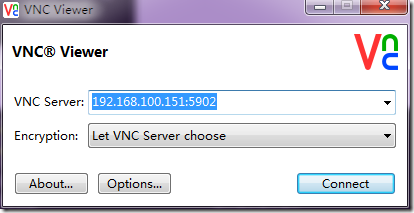

# cento开启远程桌面

yum install tigervnc tigervnc-server  

gedit /etc/sysconfig/vncservers
```
VNCSERVERS="1:root"
VNCSERVERARGS[1]="-geometry 800x600"

VNCSERVERS="2:你的用户名"
VNCSERVERARGS[1]="-geometry 800x600"
...
```
下面这段是上面所讲配置文件注解，做参考之用：  
这个是配置远程桌面登录的用户名，如果两个用户，则使用VNCSERVERS="1:user1 2:user2"   
依次类推，默认情况下，1:user1对应5901，2:user2对应5902(VNC的默认监听端口是5900，监听端口规则为590+usernumber)，如下  
VNCSERVERS="usernumber:myusername"  
下面这项配置为登录桌面配置，其中的“1”为用户序号，800x600为分辨率，-nolisten tcp为阻止tcp包，-localhost代表只监听本地，  
VNCSERVERARGS[1]="-geometry 800x600 -nolisten tcp -localhost"  

修改密码
vncpasswd
启动服务
vncserver
设置VNC服务开机启动
chkconfig vncserver on
重启
service vncserver restart

windows上安装viewvnc，输入ip地址和端口号进行连接  

如图  
