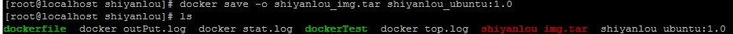

##docker相关文档
##安装

ceno7安装docker

yum install -y docker

配置开机启动

systemctl enable docker.service

启动服务

systemctl start docker.service  
##下载镜像

###网易蜂巢加速
 配置镜像加速   

- Ubuntu | Debian | Centos    

``` 
 $ sudo echo "DOCKER_OPTS=\"\$DOCKER_OPTS --registry-mirror=http://hub
-mirror.c.163.com\"" >> /etc/default/docker
 $ service docker restart 
``` 
-  Windows  

启动 Boot2docker Start Shell：  
```
$ sudo "sh -c \"echo EXTRA_ARGS=\'--registry-mirror=http://hub-mirror.c.163.com\' 
>>/var/lib/boot2docker/profile\""

```  
- Mac  

```
$ boot2docker ssh sudo "sh -c \"echo EXTRA_ARGS=\'--registry-mirror=http://hub-
mirror.c.163.com\' >>/var/lib/boot2docker/profile\"" 
$ boot2docker restart
```
###使用
配置完成后，直接  
```
docker pull ubuntu:14.04
```

##管理镜像
- 查看信息  

```
docker images
```
- 删除镜像  
```
docker rm vecId(依赖容器id)
docker rmi imgId(镜像id)
```
- 创建镜像  

在对应应用同一个文件夹下建立dockefile

  
dockerfile内容  
```

FROM docker.io/centos:latest
ENV HOSTNAME=shiyanlou
ADD dockerTest /usr/bin
#如马上运行就这样写
#RUN  dockerTest 
```
然后  
```
docker build -t shiyanlou .
```
  
- 导入导出镜像  

```
docker save -o shiyanlou_img.tar shiyanlou_ubuntu:1.0

```
 

``` 
docker load -i shiyanlou_img.tar
``` 
 
##管理容器
- 运行容器  


```
docker run -t -i shiyanlou_ubuntu:1.0 /usr/bin/dockerTest
//后台运行
docker run -t -i -d shiyanlou_ubuntu:1.0 /usr/bin/dockerTest 
//附加名字 --name
docker run --name shiyanlou_vec -t -i -d shiyanlou_ubuntu:1.0 /usr/bin/dockerTest 
参数：
设置容器名称 shiyanlou（使用--name，如果不加该参数，Docker会随机产生一个名字）。 
设置容器的主机名 shiyanlou(使用--hostname参数） 
设定网络信息，这里只使用一个简单的参数设置MAC地址（--mac-address参数） 
设置资源限制，设置容器中最大的进程数，包括soft和hard两个限制值（使用-ulimit nproc=...等参数） 
```
  


- 查看容器运行情况  

```
docker ps  
//查看所有应用
docker ps -a  
```
- 停止容器
```
docker stop vecId(容器id)
```
- 查看容器信息  

```
 //查看cpu 内存 网络io等
 docker stats >>./docker_stat.log
//查看进程信息 pid uid tty等等
 docker top f051e >>./docker_top.log
//查看容器内应用输出
 docker logs f051 >>./docker_outPut.log
```
- 退出容器
  - exit退出，此时容器停止
  - ctrl+p,ctrl+q退出，回到宿主机，容器继续运行


