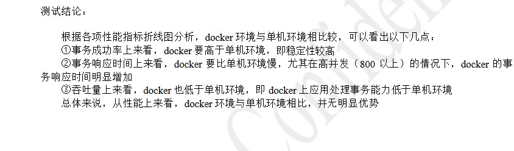

docker性能测试

 http://www.runoob.com/redis/redis-benchmarks.html

Redis性能测试——redis-benchmark使用教程  

http://blog.csdn.net/yangcs2009/article/details/50781530#t4

别人做的docker 应用程序测试  

http://wenku.baidu.com/link?url=s7joX42ixdjzmPVPr97k_2g90WX4020fTnNsv55NLa0ey8487GK5eT5IUuwMXqx5vaAxFT_xjhUgeelBIfFI33AhH-uwdB5PZnXQ4u30UaS  

 

Docker的性能损耗：以基因组分析流程为例    

http://www.jianshu.com/p/ad5bc1874976  

在这篇论文中，我们评估了Docker技术对基因组分析流程的性能影响，结果显示，对于基因组分析流程这种耗时较长的计算任务，Docker所产生的性能损耗是微不足道的。这些损耗完全可以被Docker带来的好处所抵消。
然而越是小型的作业，Docker产生的性能损耗也更明显，因为作业如果只有几秒或几毫秒，容器的启动时间就会变得不容忽视。
另外，每个基准测试分别进行的10次实验中，时间差别都很小，说明Docker隔离的环境受到外部影响较小。
